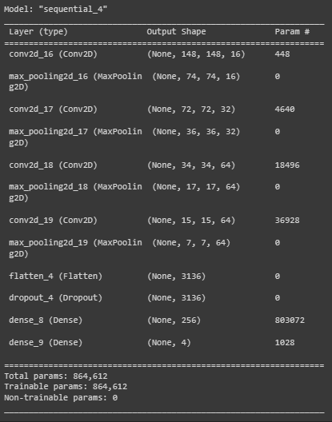
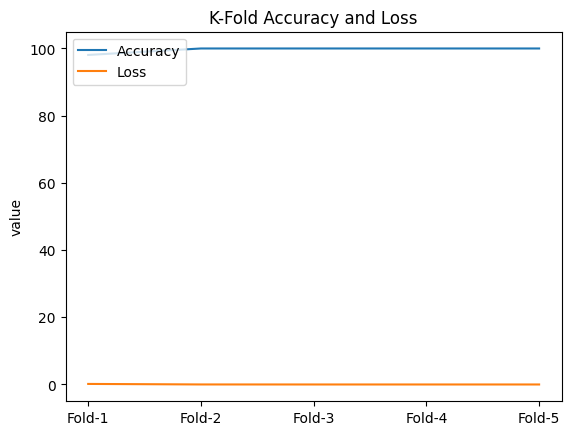

<h1>Identification of King Banana Maturity Using CNN</h1>

  Plantain is one of the most popular banana varieties and has a high demand in the market. 
The ripeness level of plantain is an important factor that affects the quality and palatability 
of the fruit. In this study, we propose a method to detect the ripeness level of plantain based 
on its skin color using Convolutional Neural Network (CNN). The proposed method 
involves several processing stages. First, we collect sample images of plantains at different 
levels of ripeness, ranging from fully ripe to immature. Then, we perform pre-processing on 
the images to remove noise and improve image quality. Next, we built a CNN model to 
perform classification based on banana peel color. The CNN model was trained using a 
dataset of King banana images with corresponding maturity level labels. After training the 
CNN model, we conducted testing using a separate test dataset. The test results show that 
the proposed method is able to detect the maturity level of plantain with high accuracy, 
namely on fold 5 resulting in 0.00000019740577650127 Loss and accuracy with a 
percentage of 100%. This method can facilitate the process of automatically classifying 
plantains based on their skin color, which in turn can help in determining harvest time and 
more effective banana supply management. In conclusion, the results of the research can be 
used to detect plantains with fairly good accuracy. This research can also be developed to 
help become a practical sorting tool.

 
<h3>Architecture CNN</h3>

  
<b>Score Per fold</b>

  <ul>
    <li>
       Fold 1 - Loss: 0.16253536939620972 - Accuracy: 98.07692170143127%
    </li>
    <li>
       Fold 2 - Loss: 0.008140583522617817 - Accuracy: 100.0%
    </li>
    <li>
       Fold 3 - Loss: 0.0010860570473596454 - Accuracy: 100.0%
    </li>
    <li>
       Fold 4 - Loss: 0.0006329502211883664 - Accuracy: 100.0%
    </li>
    <li>
       Fold 5 - Loss: 0.0008991683716885746 - Accuracy: 100.0%
    </li>
  </ul>
  
<b>Average Scores for all Folds:</b>

  <ul>
    <li>
       Accuracy: 99.61538434028625 
    </li>
    <li>
       Loss: 0.03465882571181282
    </li>
  </ul>
  

  
<b>Average fold on plot</b>

  
  

<h2>If you interested with me you can visit and talk more on social media <a href="https://github.com/albanijohanes">Check it on my github here</a></h2>
